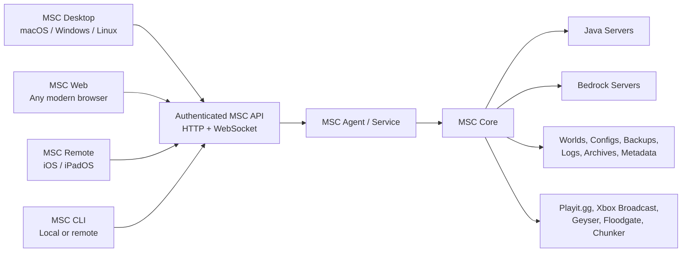

# MSC 2

## Master Product and System Vision

**Minecraft Server Controller 2** is a cross-platform application for creating, running, managing, repairing, and remotely controlling Minecraft servers. It carries forward the purpose of the original MSC: self-hosting Minecraft should feel like using a polished application, not maintaining an undocumented collection of terminal commands, configuration files, Java arguments, helper processes, and networking workarounds.

MSC 2 runs on macOS, Windows, and Linux. Every platform supports both a full graphical application and a complete headless mode. A machine can therefore be used as a normal desktop host, a dedicated server with no monitor, or both. The graphical interface, command-line interface, web interface, and iOS app are different ways of controlling the same MSC engine. They do not contain separate versions of the server-management logic.

The defining promise is:

> If an action is available in the MSC desktop interface, it is also available through the MSC service API and can be performed remotely.

MSC 2 is not merely a visual wrapper around a Minecraft launch command. It is the control plane for the entire life of a self-hosted Minecraft server: installation, Java selection, modpacks, plugins, worlds, players, backups, updates, networking, diagnostics, recovery, and day-to-day operation.

---

## Why MSC 2 Exists

The original MSC was created because hosting a Minecraft server on a personal computer is needlessly difficult for ordinary players. Realms is convenient but recurring, limited, and easy to keep paying for during months when nobody plays. Self-hosting offers more freedom and control, but it usually assumes comfort with terminals, Java versions, server JARs, configuration files, port forwarding, mods, plugins, process management, and crash logs.

MSC turns those moving parts into one understandable application.

MSC 2 expands that idea beyond macOS. A user should be able to set up a server on the computer they already own, move that server to a more efficient operating system later, and continue controlling it from the same familiar interface. A server should not be tied to the operating system on which it was first created.

This is especially important on memory-constrained hardware. On an 8 GB 2019 MacBook Pro, macOS can consume enough memory that a large modpack cannot safely receive the 5–5.5 GB it needs. A minimal Linux installation can devote substantially more of the machine to Java and Minecraft. MSC 2 makes that Linux installation practical without requiring the user to give up the MSC experience.

The Linux host may have no desktop environment at all. It can boot directly into a lightweight operating system, start MSC automatically, start the selected Minecraft server, join Tailscale, and then be managed from an iPhone, another computer, or a browser.

---

## The Product in One Sentence

MSC 2 is one cross-platform Minecraft server engine with optional desktop, web, mobile, and command-line interfaces.

---

## Core Product Principles

### One engine, many interfaces

All meaningful behavior belongs to the MSC engine. Starting a server, editing a property, restoring a backup, installing a mod, changing a world, sending a command, or reading performance data must produce the same result regardless of whether the request came from:

- The local desktop GUI
- The local command line
- The built-in web interface
- The MSC Remote iOS app
- Another authorized API client

The interfaces present state and request actions. They do not independently implement server-management behavior.

### Headless is a complete operating mode

The existing MSC headless concept is preserved and expanded. In MSC 2, headless does not only mean generating a script that launches Java with `--nogui`. It means the full MSC application engine can run without opening a window.

In headless mode, MSC still provides:

- Server creation and import
- Start, stop, restart, kill, and graceful shutdown
- Live console capture and command input
- Server settings
- Java runtime management
- Mods, plugins, modpacks, and component updates
- World management
- Backups and restores
- Player information and moderation actions
- Performance monitoring
- Crash analysis and guided repairs
- Playit.gg, Tailscale-aware remote access, and connection information
- Notifications and automation
- The complete authenticated Remote API
- The complete browser-based management interface

Closing a GUI must never stop the MSC service or the Minecraft server unless the user explicitly requests it.

### The host owns the data

The host running the MSC engine is the single source of truth. It owns:

- Minecraft server directories
- Worlds and player data
- Backups
- Configuration
- Downloaded and archived components
- Logs and performance history
- MSC metadata
- Authentication configuration

Remote clients display and control this state. They do not become co-owners of the server files. This keeps recovery and backup behavior understandable and prevents conflicts between devices.

### Familiar, not identical

MSC 2 should look and feel recognizably like the current MSC. It retains the dark control-panel appearance, server sidebar, strong status colors, tabbed server workspace, health cards, performance cards, and persistent console.

The UI does not need to imitate every native macOS control on Windows and Linux. Instead, MSC 2 has one deliberate visual identity that behaves consistently everywhere while still respecting platform conventions such as window controls, file pickers, keyboard shortcuts, notifications, and system services.

### Safe defaults with expert escape hatches

MSC should remain approachable to someone who has never hosted a server. It explains choices in Minecraft language rather than infrastructure language. At the same time, experienced users can inspect paths, edit raw files, customize launch arguments, choose Java executables, use the CLI, and connect other tools to the API.

Safe defaults include:

- Graceful stop before forced termination
- Automatic backup before destructive world operations
- Compatibility checks before installing add-ons
- Java version checks before launch
- Clear warnings before allocating unsafe amounts of RAM
- Atomic configuration writes
- Recovery copies before file replacement
- Explicit confirmation and role checks for destructive remote actions

### Local-first and private

MSC 2 remains local-first software. Server files, worlds, player information, and configuration stay on hardware controlled by the user. The application does not require a TempleTech cloud account and does not depend on a central MSC service to function.

Third-party services are contacted only for visible product functions such as downloading server software, searching Modrinth, checking versions, creating a Playit.gg tunnel, resolving player profiles, or checking connectivity. MSC does not add analytics or behavioral telemetry as a condition of use.

---

## Supported Platforms

### macOS

MSC 2 provides:

- A desktop GUI
- A background/headless service
- A command-line interface
- A local web interface
- Remote API hosting
- Native notifications and launch-at-login behavior

The background service is managed through `launchd`. The desktop window can connect to an already-running local service, so opening and closing the GUI does not change server uptime.

Java servers run directly on macOS. Bedrock Dedicated Server does not run natively on macOS, so MSC uses an isolated Linux runtime for Bedrock where required. That implementation is hidden behind the same Bedrock capability model used on other platforms.

### Windows

MSC 2 provides:

- A desktop GUI
- A Windows background service
- A command-line interface
- A local web interface
- Remote API hosting
- Native notifications and startup behavior

Java servers run directly. Bedrock Dedicated Server can run using its native Windows distribution. The service continues operating when no user is signed in and when the desktop GUI is closed.

### Linux

MSC 2 provides:

- A desktop GUI when a graphical environment is present
- A first-class headless daemon
- A command-line interface
- A local or remotely accessible web interface
- Remote API hosting
- `systemd` service integration

Java and Bedrock Dedicated Server can run directly on supported Linux systems. MSC 2 is designed to work on a minimal Debian installation without GNOME, KDE, a display manager, or a connected monitor.

Ubuntu is supported, but Debian minimal is a particularly good host for low-memory systems because it can run with a much smaller base footprint when installed without a desktop environment. MSC itself should not require a graphical stack in headless mode.

### iOS and iPadOS

MSC Remote remains a native companion experience. It connects to any MSC 2 host, regardless of whether that host runs macOS, Windows, or Linux.

The phone is not a reduced “status-only” remote. It exposes the full set of operations that can be used safely on a mobile screen, including server creation and configuration, lifecycle control, console, players, worlds, backups, components, updates, files, connection management, and diagnostics.

Some workflows may use a mobile-specific layout, but they use the same API and capabilities as the desktop application.

### Web browsers

Every MSC host can optionally serve the MSC web interface. A user can open a browser on a laptop, tablet, or phone and manage the server without installing the desktop application on that client.

The web interface is especially important for a headless Linux host. The Linux machine runs the MSC service; the visual interface is loaded from the machine being used to control it.

The web interface is not a separate administration product. It shares the same design language and feature model as the desktop GUI.

---

## The Three Ways MSC Runs

### Desktop mode

Desktop mode opens the complete graphical application. If the local MSC service is already running, the window attaches to it. If no service is running, the application can start an embedded local engine or install/start the background service, depending on the user’s preference.

The desktop interface feels immediate because it is controlling a local service, but it still follows the same API contracts as remote clients.

Example:

```text
msc gui
```

### Service mode

Service mode runs the entire MSC engine with no visible window. It owns the server processes, API, scheduled work, monitoring, and persistent state.

Example:

```text
msc serve
msc serve --bind 127.0.0.1 --port 48400
msc serve --bind tailscale
```

On a dedicated Linux installation, this is the normal mode.

### Command-line mode

The CLI gives local administrators and scripts a direct interface to the same engine.

Examples:

```text
msc status
msc servers list
msc server start "Modded Survival"
msc server stop "Modded Survival"
msc server restart "Modded Survival"
msc command "Modded Survival" "say Server restart in five minutes"
msc backup create "Modded Survival"
msc backup list "Modded Survival"
msc logs follow "Modded Survival"
```

The CLI should be human-readable by default and support structured JSON output for scripts.

---

## System Shape



The application is divided conceptually into four products built around one shared model:

- **MSC Core** contains server-management behavior and platform-neutral domain rules.
- **MSC Agent** runs Core as a persistent service and exposes the API.
- **MSC Desktop** provides the cross-platform graphical experience.
- **MSC CLI and remote clients** control an agent locally or over a trusted network.

The intended technical foundation is:

- Rust for the core engine, long-running service, process control, API, filesystem work, and CLI
- Tauri for the macOS, Windows, and Linux desktop shell
- A shared TypeScript web frontend, with a focused framework such as Svelte, for the desktop and browser interfaces
- The existing native Swift iOS app evolved to speak the MSC 2 API

Rust is used because the engine must be reliable, memory-efficient, easy to distribute as a single native binary, and able to run without a GUI on all three desktop operating systems. Tauri provides a cross-platform window without carrying the memory cost of a full Electron/Chromium application. The graphical layer is replaceable; the engine and API remain the durable center of the product.

Swift itself is available on Windows and Linux, but SwiftUI and AppKit are not. Reusing the current SwiftUI desktop interface directly would therefore preserve the platform limitation MSC 2 is intended to remove.

---

## The MSC 2 Desktop Experience

### Overall visual identity

MSC 2 uses a dark, focused interface inspired by the current application:

- Near-black page background
- Slightly lighter elevated panels
- Rounded status and information cards
- Green for healthy/running state
- Amber for warnings and maintenance
- Red for stopped, failed, or destructive actions
- Blue for primary actions and Java identity
- Purple or platform-specific accents for Bedrock and cross-play features
- Minecraft player skins and world imagery used sparingly as recognizable anchors
- Dense information without feeling like a generic enterprise dashboard

The application should feel capable and calm. A first-time user sees clear actions and explanations. An experienced user can scan the same screen and immediately understand server health.

### Global layout

The desktop window has four stable regions:

1. **Application header** — MSC identity, global host status, alerts, connection state, help, settings, and update status.
2. **Server sidebar** — server selector, start/stop controls, connection shortcuts, quick commands, frequently changed world settings, and server identity.
3. **Server workspace** — the current server’s main tabbed content.
4. **Persistent console drawer** — live output and command entry, available from every server tab.

The server workspace retains the recognizable MSC tab structure:

- Overview
- Players
- Worlds
- Packs
- Performance
- Components
- Settings
- Files

Tabs may appear or adapt based on server capabilities. For example, a Vanilla server does not pretend to have plugin controls, and a Bedrock server presents Bedrock-specific properties and allowlist behavior.

### Multiple servers

MSC can own multiple configured servers. Each server has a clear state:

- Running
- Starting
- Stopping
- Stopped
- Updating
- Backing up
- Restoring
- Repairing
- Crashed
- Attention required

The sidebar makes it easy to switch servers without losing current activity. The agent continues managing all allowed running servers even when none is selected in the GUI.

Resource checks warn when starting another server would exceed safe host memory or port availability. MSC does not silently overcommit the machine.

---

## Overview

The Overview tab answers four questions immediately:

1. Is the server running?
2. Can players connect?
3. Is it healthy?
4. What needs attention?

It includes:

- Server name, flavor, Minecraft version, active world, and uptime
- Local, Tailscale, public, Playit.gg, Java, and Bedrock connection details as applicable
- Address masking for screenshots or screen sharing
- Copy and share actions
- Online player count and recent joins
- Live CPU, memory, TPS, MSPT, and tick-health summaries
- Server directory, Java runtime, component, RAM, port, backup, and last-start health cards
- Alerts for unsafe RAM, outdated components, failed backups, port conflicts, missing Java, EULA state, or crash recovery
- Server notes
- Clear start, stop, restart, update, backup, and maintenance actions

The status cards are actionable. Selecting a warning opens an explanation and the relevant repair or settings view.

---

## Server Creation and Import

The creation experience is guided but not restrictive.

### Supported Java server families

- Paper
- Purpur
- Vanilla
- Fabric
- NeoForge
- Forge

The user chooses the server family and Minecraft version. MSC then resolves the appropriate server build, installer, Java version, directory layout, component folder, and compatible add-on sources.

### Modpack creation

MSC supports creating a server from:

- A Modrinth `.mrpack`
- A compatible CurseForge pack
- An existing server pack archive
- An existing server directory
- A manually selected server JAR or installer

For a pack, MSC distinguishes server-required, optional, and client-only files. It downloads required dependencies, honors overrides, records source metadata, and creates an exportable client package or installation instructions for players.

### Importing existing MSC servers

MSC 2 can import servers created by the original MSC without requiring the user to rebuild the world or pack. It recognizes:

- Existing Java server directories
- Existing world slots
- Backups
- Plugins and mods
- Server properties
- Existing MSC metadata where available
- Custom launch options

Imported files remain the user’s files. MSC records what it discovers and clearly identifies settings it cannot infer.

### Bedrock creation

On Windows and Linux, MSC installs and runs the platform’s Bedrock Dedicated Server distribution directly. On macOS, it provisions the required lightweight Linux execution environment while presenting the same user-facing workflow.

The user should not need to understand whether the backend uses a native process, container, or VM. They see a Bedrock server with consistent controls and diagnostics.

---

## Java Runtime and Memory Management

MSC 2 treats Java as a managed prerequisite, not an unexplained error message.

It can:

- Detect installed Java runtimes
- Identify vendor, version, architecture, and executable path
- Match Minecraft versions to supported Java major versions
- Recommend and optionally install an appropriate runtime
- Assign a runtime globally or per server
- Validate the runtime before launch
- Preserve custom Java paths for advanced setups
- Explain why a server cannot start with the selected Java version

### RAM controls

The memory setting distinguishes Java heap from total machine memory. MSC explains that `-Xmx5G` does not mean the process will consume only 5 GB; Java also needs memory for metaspace, threads, buffers, libraries, the operating system, MSC, and helper processes.

MSC displays:

- Installed physical memory
- Currently available memory
- Configured initial and maximum Java heap
- Estimated non-heap overhead
- Current process resident memory
- Swap usage
- A safe allocation recommendation

On an 8 GB minimal Debian host, a 5 GB heap is a reasonable initial target for a demanding pack, with 5.5 GB available only when real measurements show sufficient headroom. MSC warns before unsafe allocations but allows an informed override.

### Swap awareness

MSC detects swap and reports its status. Swap is treated as an emergency cushion, not extra server RAM. On an 8 GB dedicated Linux host, a 4 GB swap file with low swappiness can reduce the chance that the kernel kills Java during a temporary spike. Sustained swapping is reported as a performance problem because it can cause severe tick lag.

The performance view differentiates:

- Healthy unused swap
- Brief emergency swap activity
- Sustained memory pressure
- Imminent out-of-memory risk

---

## Server Lifecycle and Process Ownership

The MSC agent owns every server process it starts. It records process identity, launch configuration, start time, state transitions, and exit information.

Lifecycle actions include:

- Start
- Graceful stop
- Restart
- Scheduled restart
- Forced termination
- Send command
- Attach to live console
- Recover state after the GUI reconnects

Stopping the desktop window does not stop the server. Logging out of the Linux or Windows machine does not stop a service-managed server. Reboot behavior is explicit per server:

- Do not start automatically
- Start when MSC starts
- Restore the state that existed before shutdown

Before forced termination, MSC warns about world corruption and offers a final graceful-stop attempt. If the operating system or Java process crashes, MSC explains what happened using the evidence available from logs and exit status.

The agent prevents duplicate launches of the same server directory. It also detects when another unmanaged Java or Bedrock process is already using the configured directory or port.

---

## Console and Commands

The console is a first-class live stream, not a static log box.

It provides:

- Real-time output through WebSocket events
- Color and category treatment for chat, joins, warnings, errors, commands, and system messages
- Search
- Filters
- Pause and resume
- Copy
- Clear local view without deleting source logs
- Download or export session log
- Command history
- Favorites
- Quick commands
- Command suggestions where safe

Console history remains available when a remote client reconnects. The API sends a bounded recent history followed by live events, avoiding both an empty console and unbounded memory use.

Commands are attributed in the MSC audit log to the local GUI, CLI user, or remote token that sent them.

---

## Players

The Players tab combines live player presence with useful historical context.

It includes:

- Online and offline players
- Java and Bedrock identity where cross-play is active
- Player skin or avatar
- UUID or XUID where appropriate
- First seen, last seen, session duration, and recent session timeline
- Operator and allowlist status
- Position, dimension, health, game mode, and inventory when available and safe to read
- Notes or local labels
- Message, kick, ban, pardon, whitelist, and operator actions with permission checks

Player data readers understand the differences between Java NBT data, server logs, Bedrock LevelDB data, Geyser/Floodgate identity mapping, and live server output. MSC clearly labels information that is unavailable rather than fabricating parity between server types.

---

## Worlds

World management preserves the current world-slot idea and makes every operation available locally or remotely.

Users can:

- View the active world and available world slots
- Create a new world
- Duplicate a world
- Rename a world
- Activate or swap a world
- Archive a world
- Export a world
- Import or replace a world
- Delete a world with confirmation
- Repair common world-layout issues
- Convert compatible worlds using Chunker where supported
- View world metadata and thumbnails

Before activating, replacing, restoring, or deleting a world, MSC validates paths and offers or requires a backup based on the risk of the operation.

World operations are transactional wherever practical. A failed import or replacement should leave the previous active world recoverable.

---

## Backups

Backups are understandable, inspectable, and independent from the UI.

MSC supports:

- Manual backups
- Scheduled backups
- Backup before stop, update, restore, or world replacement
- Retention by count, age, and storage limit
- Optional compression
- Backup metadata
- Integrity verification
- Restore preview
- Restore to the current server
- Restore as a new world slot
- Export and download

Each backup records:

- Server identity
- World identity
- Creation time
- Minecraft and loader version
- Reason for creation
- Size
- Integrity state
- Whether the server was online or paused

The UI never uses the word “backup” for a copy that has not completed successfully.

---

## Mods, Plugins, Modpacks, and Components

MSC 2 keeps the current in-app component experience and makes it platform-independent.

### Catalog browsing

Users can browse Modrinth and supported plugin sources inside MSC. Search results are filtered using:

- Minecraft version
- Server loader
- Plugin platform
- Server-side compatibility
- Required dependencies
- Client-only status

Project pages show description, versions, compatibility, dependencies, source, and installed state.

### Installed component management

MSC can:

- Install
- Enable and disable
- Remove
- Reinstall
- Pin a version
- Update one component
- Update all compatible components
- Detect manually installed JAR metadata
- Identify likely source projects through hashes
- Explain unresolved or incompatible files

Pack-managed files are clearly distinguished from user-managed files. MSC avoids silently changing files whose versions are intentionally controlled by a modpack unless the user chooses to take ownership or update the pack.

### Dependency safety

Required dependencies are resolved automatically. Optional dependencies are explained. Client-only mods are flagged and excluded from server installation unless there is a specific reason to retain them.

### Client sharing

MSC can create a player-facing package or manifest containing the matching client mods, resource packs, versions, and connection instructions. It must not redistribute files whose licenses prohibit redistribution; in those cases it generates source links or a manifest that downloads from the original provider.

### Server components

MSC also manages:

- Paper, Purpur, and Vanilla server JARs
- Fabric loader and Fabric API
- NeoForge and Forge installations
- Geyser
- Floodgate
- Bedrock server versions
- Playit.gg helper
- MCXboxBroadcast
- Chunker
- Other explicitly supported helpers

Downloaded versions may be archived locally for fast reinstall and rollback. Archives have visible size, origin, version, checksum, and deletion controls.

---

## Settings

MSC presents common Minecraft settings as understandable controls while preserving raw-file access.

Settings include:

- Server name and local metadata
- Minecraft version and server flavor
- World name, seed, type, game mode, difficulty, and hardcore
- PvP, spawning, command blocks, flight, view distance, simulation distance, and player limits
- Whitelist/allowlist and operator permissions
- Network ports and bind addresses
- Java runtime and launch memory
- Additional JVM arguments
- Backup behavior
- Auto-start, restart, and crash behavior
- Update policy
- Resource packs
- Geyser and Floodgate
- Purpur-specific options
- Playit.gg
- Xbox Broadcast
- Remote access and tokens

MSC distinguishes:

- Changes that apply immediately
- Changes requiring a server restart
- Changes requiring component reprovisioning
- Changes that may affect world compatibility

The raw `server.properties` and supported component configuration files remain accessible in the Files area or an advanced editor. Structured controls preserve unknown fields instead of replacing a file with only the properties MSC recognizes.

---

## Files

The Files tab is a guarded server-focused file manager.

It provides:

- Browse server files
- View and edit text configuration files
- Search within files
- Upload and download through an authorized client
- Rename, duplicate, move, archive, and delete
- Reveal in the native file manager on a local desktop
- Display size, modification time, and type
- Protect known critical paths

Remote file transfer uses dedicated streaming endpoints with strict path validation, size limits, temporary files, and atomic completion. It is not forced through small JSON request bodies.

All paths are resolved relative to approved server roots. `..`, symlink escapes, and arbitrary host filesystem browsing are rejected unless an explicit advanced local-only capability is enabled.

---

## Performance

MSC shows both host health and Minecraft health.

Metrics include:

- Host CPU and load
- Host physical memory, available memory, and swap
- MSC agent memory
- Minecraft process CPU and resident memory
- Java heap usage when available
- TPS
- MSPT
- Tick warnings
- Player count
- Network traffic
- Disk usage and free space
- Backup storage
- Uptime
- Restart and crash history

Live graphs use bounded history so the agent remains lightweight. Longer-term history is sampled and stored efficiently.

MSC turns measurements into explanations:

- “TPS is healthy.”
- “The server is falling behind because average tick time is above 50 ms.”
- “Java is using swap; reduce heap or close other processes.”
- “The host has enough memory, but this pack may need more heap.”
- “Disk space is too low for the next scheduled backup.”

The goal is to teach the user what the numbers mean without hiding the actual numbers.

---

## Diagnostics and Recovery

MSC 2 expands the current startup crash analyzer into a cross-platform diagnostic system.

It recognizes common failures such as:

- Missing or incompatible Java
- Incorrect Java architecture
- Invalid JVM arguments
- Port already in use
- EULA not accepted
- Missing server JAR or args file
- Failed Forge or NeoForge installation
- Loader and mod incompatibility
- Missing dependencies
- Client-only mod on the server
- Corrupt or incomplete downloads
- Permission errors
- Invalid world directory
- Out-of-memory termination
- Disk full
- Bedrock runtime failure
- Helper-process failure

A diagnostic result contains:

- A plain-language summary
- The evidence MSC found
- The affected component
- Whether data is at risk
- A recommended repair
- An advanced view with raw log context

Repairs can include update, reinstall, rollback, disable suspected component, switch Java, restore configuration, release a port, or open the relevant file. MSC never labels a repair successful until the server passes an appropriate start or validation check.

---

## Networking and Player Connections

MSC separates two kinds of remote access:

1. **Player access to Minecraft**
2. **Administrator access to MSC**

These are configured independently.

### Player access

MSC can present and manage:

- LAN address
- Tailscale address for a private group
- Router port-forwarding guidance
- Public IP and port checks
- DuckDNS hostname
- Playit.gg tunnel
- Geyser/Floodgate Bedrock access
- Xbox Broadcast discovery
- Simple Voice Chat tunnel when detected

Players do not need Tailscale if the server is exposed through Playit.gg or normal port forwarding. Tailscale is useful when all players are trusted members of the same private tailnet.

### Administrator access

MSC’s management API is private by default. It binds to loopback unless the user enables LAN or VPN access.

For access outside the home, Tailscale is the preferred transport:

- Tailscale runs on the MSC host.
- Tailscale runs on the iPhone or remote computer.
- The client connects to the host using its MagicDNS name or Tailscale IP.
- No router port is opened for the MSC administration API.

An example endpoint is:

```text
http://msc-linux:48400
```

or:

```text
http://100.x.y.z:48400
```

The host may bind the API only to loopback and the Tailscale interface, or enforce firewall rules that accept management traffic only from the tailnet.

MSC should not recommend publicly forwarding port `48400`. Playit.gg and public tunnels intended for Minecraft traffic are not automatically used for the administration API.

---

## Remote API

The API is a stable product surface, not an internal side effect of the desktop application.

It provides:

- Versioned HTTP endpoints for requests and snapshots
- WebSockets for console, status, task progress, players, notifications, and metrics
- Capability discovery
- Backward-compatible data models
- Idempotency support for operations that may be retried
- Structured errors with user-readable messages
- Progress reporting for long actions
- Cancellation where safe

### Capability discovery

Clients ask the agent what it can do. Capabilities reflect:

- Host operating system
- Server type
- Installed helpers
- User/token permissions
- Agent version
- Server state

This allows one iOS or desktop client to control different hosts without assuming that every feature is implemented identically underneath.

### Long-running operations

Installing a modpack, downloading Java, converting a world, restoring a backup, or installing Forge can take minutes. These requests return an operation identity. Clients receive progress events and can reconnect without losing the operation.

### Compatibility

New fields are additive and optional wherever possible. Clients and agents may be on different versions. The agent reports its API version and supported capabilities, and clients hide or explain unavailable features.

---

## Authentication, Permissions, and Security

Pairing remains simple for a home user while supporting stronger controls.

### Pairing

A local desktop or web session can display a QR code containing:

- Host address
- Tailnet or LAN address preference
- Agent identity
- Short-lived pairing secret
- API version

The iOS app scans the code, exchanges the pairing secret for a durable device token, and stores that token in the platform keychain.

### Roles and permissions

MSC supports:

- Owner/admin
- Operator
- Viewer/guest
- Named tokens with selected permissions

Permissions cover areas such as:

- View status and console
- Send commands
- Start and stop
- Manage players
- Manage worlds
- Manage backups
- Manage components
- Edit settings
- Transfer files
- Manage authentication

Destructive operations require an appropriate role even when the network itself is trusted.

### Transport security

On loopback, plain local HTTP is acceptable. Across a LAN, HTTPS can be enabled using a locally managed certificate. Across Tailscale, traffic already travels through an encrypted network tunnel, but token authentication remains mandatory.

The agent includes:

- Request size limits appropriate to each endpoint
- Rate limiting
- Brute-force resistance
- Token revocation
- Expiring pairing codes
- Secret storage using Keychain, Windows Credential Manager/DPAPI, or a protected Linux secret/config store
- Strict path validation
- Audit records for important remote actions
- No default exposure on all public interfaces

Passwords for third-party services are avoided where token or device-code flows are available.

---

## The Web Interface on a Headless Host

A headless host does not need its own display in order to provide a GUI.

The Linux machine runs:

```text
Debian
├── tailscaled
├── msc serve
└── java / bedrock_server
```

The user opens a browser on another device and visits the MSC host over LAN or Tailscale. The page assets are served by the MSC agent, and all actions go back to the same API.

This means:

- The Linux machine uses no desktop environment.
- The GUI consumes memory on the client device, not the server.
- The server can sit closed, headless, or connected only to power and Ethernet.
- The same host is reachable from the native iOS app.
- Administration continues even after the controlling browser is closed.

The browser interface clearly displays which host it is controlling to prevent accidental actions on the wrong server.

---

## MSC Remote for iPhone and iPad

MSC Remote becomes a complete mobile administration client.

### Mobile dashboard

The dashboard shows:

- Host and selected server identity
- Running state
- Start, stop, and restart
- Player count
- TPS, RAM, CPU, and uptime
- Connection cards
- Active alerts
- Backup freshness
- Recent joins and departures

### Mobile navigation

The app includes:

- Dashboard
- Console
- Commands
- Players
- Worlds
- Backups
- Packs and components
- Settings
- Files
- Host and connection settings

Long tasks continue on the host when the iOS app is backgrounded. Push or local notifications can report completion, failure, crashes, restarts, player joins, and backup problems according to user preference.

### Mobile safety

Actions such as restoring a world, deleting files, changing server versions, or forcing termination use clear confirmation. Authentication can be protected with Face ID or device passcode before high-risk operations.

---

## Cross-Platform Behavior

The product exposes consistent capabilities while respecting real platform differences.

| Capability | macOS | Windows | Linux |
|---|---|---|---|
| Full desktop GUI | Yes | Yes | Yes, when a desktop is installed |
| Complete headless service | `launchd` | Windows Service | `systemd` |
| CLI | Yes | Yes | Yes |
| Web management | Yes | Yes | Yes |
| Java server | Native process | Native process | Native process |
| Bedrock server | Managed Linux runtime | Native process | Native process |
| Secure secret storage | Keychain | Credential Manager/DPAPI | Protected store or system keyring |
| Native file reveal | Finder | Explorer | Configured file manager |
| Remote access | LAN/Tailscale | LAN/Tailscale | LAN/Tailscale |

Platform-specific code belongs behind explicit system interfaces. Server models, settings, API behavior, operation status, and UI concepts remain shared.

---

## The Dedicated Linux Host Experience

The ideal low-memory deployment is a minimal Debian installation with no graphical desktop.

At boot:

1. Linux starts networking.
2. Tailscale joins the user’s tailnet.
3. The MSC service starts.
4. MSC validates its storage and configured servers.
5. Servers marked for automatic start launch when dependencies are ready.
6. The user connects from iOS, a browser, or another MSC desktop app.

The host’s idle memory is reserved as much as possible for Minecraft. The MSC service is designed to remain small when idle and to avoid retaining unbounded console, metric, catalog, or task data in memory.

The 2019 MacBook Pro requires special attention because its Apple T2 chip affects Linux support for built-in keyboard, trackpad, Wi-Fi, audio, fans, and other hardware. MSC 2 does not solve kernel support itself, but its Linux documentation recognizes T2-compatible kernels and the T2 Linux community as part of running on that hardware. For a headless host, reliable networking, storage, thermals, and sleep behavior matter more than desktop polish.

The host must not sleep while a server is running. MSC reports suspend configuration problems and can integrate with the platform’s sleep-inhibition mechanism.

---

## Reliability and Data Integrity

MSC 2 is infrastructure for worlds people care about. Reliability takes priority over visual convenience.

### Configuration

- Configuration writes are atomic.
- Schemas are versioned.
- Migrations preserve recovery copies.
- Unknown fields are retained where possible.
- Secrets are separated from ordinary configuration.
- Human-readable server metadata can be exported.

### Downloads

- Downloads use temporary files.
- Checksums are verified when providers publish them.
- A file is moved into active use only after successful validation.
- Interrupted downloads can be retried safely.
- Cached files record their origin and version.

### Operations

- Only one conflicting operation runs against a server at a time.
- Long operations have explicit states.
- The agent survives client disconnects.
- On restart, the agent reconciles incomplete operations and explains their outcome.
- Dangerous filesystem targets are resolved and validated before mutation.

### Backups

- Backup success means the archive was completed and validated.
- Restore preserves the previous state until the replacement is ready.
- Scheduled retention never deletes the only known good backup merely to satisfy a count.

### Logs and audit trail

MSC keeps:

- Application log
- Per-server session log
- Server stdout/stderr
- Operation history
- Important administrative action history
- Crash and restart history

Retention is configurable and bounded.

---

## Updates

MSC distinguishes four update categories:

- MSC application/agent updates
- Minecraft server runtime updates
- Loader updates
- Mod, plugin, and helper updates

Updates are never presented as one undifferentiated “Update All” when compatibility or world safety differs.

Before a significant server update, MSC shows:

- Current and target versions
- Known compatibility concerns it can determine
- Components that will become incompatible
- Whether a backup is required
- Rollback material available locally

Headless agents can notify clients that an update is available without installing it automatically. Automatic update policies are configurable by category.

The desktop and agent can be updated independently within a supported compatibility window.

---

## Notifications

Notifications can be generated for:

- Server started
- Server stopped unexpectedly
- Restart completed
- Player joined or left
- Backup succeeded or failed
- Update available
- Mod or plugin incompatibility detected
- High memory pressure
- Low disk space
- TPS degradation
- Remote login or new device paired
- Long-running operation completed

Notification rules are configured per server and per client. A dedicated host does not require a local desktop notification service for remote clients to receive useful events.

---

## Onboarding and Help

MSC 2 keeps the current application’s teaching role.

Onboarding establishes:

- Where the server will live
- Which server family or pack is being used
- Which Java runtime is required
- How much memory is safe
- How players will connect
- Whether Bedrock cross-play is wanted
- Whether remote administration is enabled
- Whether backups and auto-start are enabled

The Server Handbook remains available inside every interface. Help is contextual: selecting a warning, setting, performance metric, or connection method opens the explanation relevant to that item.

MSC uses direct language:

- “Players outside your home cannot reach this port.”
- “This mod is intended only for players’ clients.”
- “Your server needs Java 21, but Java 17 is selected.”
- “The server used swap for four minutes, which can cause lag.”

The application teaches without forcing the user to leave the interface and search for terminology.

---

## Privacy and External Services

MSC 2 does not require analytics, telemetry, cloud synchronization, or a hosted TempleTech account.

It may connect to external services for defined functions:

- Mojang version metadata and Vanilla server downloads
- PaperMC and Purpur builds
- Fabric, NeoForge, and Forge metadata/installers
- Bedrock Dedicated Server manifests and downloads
- Adoptium Java runtimes
- Modrinth and supported plugin catalogs
- Geyser and Floodgate downloads
- Playit.gg tunnel management
- GitHub releases for explicitly managed helper tools
- Xbox services used by MCXboxBroadcast
- Player profile and avatar services
- Public IP and Minecraft connectivity checks
- DuckDNS updates when configured

The UI identifies why a service is contacted. Server worlds, inventories, console logs, credentials, and configuration are not sent to TempleTech.

---

## Product Identity

MSC 2 should still feel personal. It was created to make hosting a server for friends and family less frustrating and less expensive, not to turn a home Minecraft world into a corporate hosting product.

The interface can be powerful without becoming cold. Player skins, world thumbnails, readable connection cards, clear health language, and the always-available console keep the application connected to the game it manages.

The audience includes:

- Someone replacing a Realm
- A family hosting a shared world
- Friends running a modpack
- A Mac user moving an existing server to Linux
- A technically curious user learning server administration
- An experienced user who wants reliable controls without repetitive manual work

MSC 2 is not intended to become a billing platform, a public hosting marketplace, or a large-network orchestration system. Its center remains self-hosted Minecraft on computers the user owns or directly controls.

---

## Definition of Full Functionality

MSC 2 has full functionality when the host can run with no graphical session and a remote authorized client can perform the complete life-cycle of server ownership:

- Create or import a server
- Install the correct runtime
- Configure memory and launch behavior
- Start and stop it reliably
- Watch and search its console
- Send commands
- View and manage players
- Install and update compatible mods and plugins
- Import and maintain modpacks
- Create, switch, repair, export, and restore worlds
- Create, verify, retain, download, and restore backups
- Edit structured settings and raw configuration files
- Diagnose failed starts and apply repairs
- Monitor host and Minecraft performance
- Configure how players connect
- Configure secure remote administration
- Update MSC and server components
- Recover from a disconnected client, closed GUI, logout, or reboot

No graphical window is required on the host for any of these capabilities.

---

## The Essential MSC 2 Experience

A user installs minimal Debian on the 2019 MacBook Pro, enables the MSC service, imports the existing modded server, allocates approximately 5 GB of Java heap, and configures a 4 GB emergency swap file. The laptop boots with no desktop environment. Tailscale and MSC start automatically.

From an iPhone, the user opens MSC Remote and selects the host by its Tailscale name. The dashboard shows that the modded server is stopped, the last backup is healthy, the pack has no unresolved dependencies, and enough memory is available. The user taps Start.

MSC validates Java, memory, ports, files, and the active world. It starts the server, streams installation or startup progress, and then changes the state to Running. The phone displays live TPS, memory, console, and players. Friends connect through Playit.gg or the configured public route. The administration API remains private on Tailscale.

Later, the user opens the MSC desktop app on Windows or macOS. It connects to the same Linux host and displays the same familiar MSC layout. The Linux machine still has no GUI installed. Closing the desktop app changes nothing about the running server.

That is MSC 2: the full MSC experience wherever the user is, with the Minecraft host spending its resources on Minecraft rather than on a desktop operating system.

