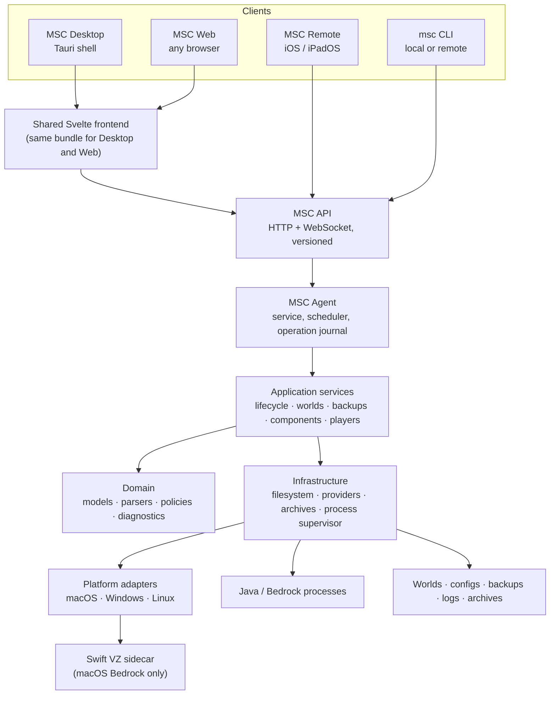

# MSC 2 — Engineering Specification

**Revision:** 1.4 · **Date:** 2026-07-30 · **Owner:** Cameron Temple
**Baseline:** MSC 1 at commit `fccd61f0ed743086f1f5db6bef58e228a36010f3`

**Companion documents:**
- `msc2-product.md` — what MSC 2 is, in plain language, for anyone
- `MSC2-VISION.md` — index, revision state, and precedence rules for this document set
- `msc2-decisions.md` — the decision register: what was decided, by whom, why, and what was rejected
- `msc2-port-plan.md` — execution sequencing and the fixture inventory (separate on purpose; it changes, this does not)

**How to read this document.** It is written to be picked up cold. Sections 1–4 establish what MSC 2 is and why it is shaped this way. Sections 5–11 are the technical contract. Sections 12–14 describe the state of MSC 1 and the plan for porting it. If you are about to write code, read sections 5, 6, 13, and 14.

**Rule of precedence.** Where this document and `msc2-decisions.md` disagree, the decision register wins — it records the reasoning, and this document is downstream of it.

---

## 1. What MSC 2 is

MSC 2 is the control plane for self-hosted Minecraft servers: creation, runtime management, worlds, backups, mods, players, diagnostics, networking, and updates.

Architecturally it is **one engine with several interfaces**. All server-management behavior lives in a Rust service. Every graphical, mobile, and command-line surface is a client of that service's API. No client implements server-management logic.

The defining constraint:

> If an action is available in the MSC desktop interface, it is available through the MSC API and can be performed remotely.

This is not aspirational. It is enforced structurally: there is only one implementation of any action, so a client cannot have a capability the API lacks.

### Why this shape

MSC 1 fused engine and UI. Server-management logic lives inside SwiftUI view models, so running MSC requires running a macOS GUI session. Every limitation follows from that: no Linux host, no true headless mode, no Windows, and an iOS client that could only do what someone had hand-exported to the Remote API.

Splitting engine from interface removes all of them at once, and makes client parity a property of the architecture rather than a project that must be repeated.

---

## 2. System architecture



### Component responsibilities

| Component | Owns |
|---|---|
| **Domain** | Value types, parsers, compatibility rules, diagnostics policy, version comparison. No I/O. |
| **Application services** | Workflows: start a server, restore a backup, import a modpack. Orchestrates domain + infrastructure. Owns operation state. |
| **Infrastructure** | Filesystem repositories, HTTP providers, archive handling, process supervision, metrics collection, config persistence, audit log. |
| **Platform adapters** | Per-OS implementations behind shared traits: services, secret storage, process enumeration, file reveal. |
| **Agent** | Process lifetime, dependency assembly, scheduled work, operation recovery on restart, API hosting, static asset serving. |
| **API** | Routes, DTOs, WebSocket events, authentication, capability advertisement. |
| **Clients** | Presentation and request initiation only. |

### The single-owner principle

The host running the agent is the sole owner of all server state: directories, worlds, player data, backups, configuration, archives, logs, metadata, and authentication configuration.

Clients display and request. They never become co-owners. This is what keeps recovery, backup, and conflict behavior comprehensible when three clients are connected at once.

---

## 3. Technology stack

| Layer | Choice | Notes |
|---|---|---|
| Engine, service, API, CLI | **Rust** | Single binary per platform. See D-002. |
| HTTP / WebSocket | `axum` + `tokio` | Replaces MSC 1's hand-written socket server. |
| CLI parsing | `clap` | Generates shell completions. |
| Interactive prompts | `inquire` | Fuzzy select, confirm. Phase: after core CLI. |
| Terminal UI | `ratatui` + `crossterm` | **v1 non-goal**, deferred to v1.1 (D-015). |
| Progress | `indicatif` | Downloads, installs. |
| Desktop shell | **Tauri** | Thin. Loads the Svelte bundle. |
| Frontend | **Svelte + TypeScript** | One bundle, served by the agent and loaded by Tauri. |
| iOS client | **Swift / SwiftUI** | Existing app, re-pointed. See D-004. |
| Secret storage | `keyring` crate **+ headless fallback** | Keychain / DPAPI behind one trait. **The crate is not sufficient on headless Linux** — see §8. |
| Hashing | Rust-native | Replaces CryptoKit usage. |
| Images | `image` crate | Replaces AppKit `NSImage` skin handling. |
| macOS Bedrock VM | **Swift sidecar** | `Virtualization.framework`. See D-007. |

---

## 4. The three run modes

**Desktop mode.** The Tauri application opens. If a local agent is running it attaches; otherwise it offers to install and start the service. The desktop experience feels immediate because the agent is local, but it uses the same API contract as any remote client.

**Service mode.** The agent runs with no window: owns server processes, the API, scheduled work, monitoring, and persistent state.

```
msc serve
msc serve --bind 127.0.0.1:48001
msc serve --bind tailscale
```

**CLI mode.** Direct commands against a local or remote agent.

```
msc status
msc server start "Modded Survival"
msc command "Modded Survival" "say restarting in 5"
msc backup create "Modded Survival" --json
msc --host msc-linux server restart "Modded Survival"
```

Human-readable by default; `--json` on everything; meaningful exit codes; colors and spinners disabled automatically when stdout is not a TTY.

---

## 5. The API contract

### Source of truth

A versioned **OpenAPI** description plus explicit **WebSocket event schemas** is the single source of truth. It generates the Rust server types and the Swift iOS client models. Hand-written client models are not permitted — that is what `MSCmacOSTests/iOSModelMirrors.swift` exists to guard against today, and code generation retires the problem.

### MSC 1's API is the compatibility **baseline**, not the whole of MSC 2's API

Three distinct things follow from this, and conflating them is a mistake:

1. **Baseline.** Where MSC 1's API already covers a capability, its externally observable behavior is normative. Existing clients — above all the shipped iOS app — must keep working.
2. **Extension.** MSC 2's API is a **superset**. MSC 1 has desktop capabilities its Remote API never exposed; the parity work identified these, and MSC 2 must add endpoints for them. The baseline defines what may not break, not what may not be added.
3. **Correction.** Documented bugs, security weaknesses, and genuinely wrong semantics **may be fixed** rather than preserved forever. A quirk is not a contract simply because it shipped. Corrections are recorded explicitly, versioned per D-010, and never made silently.

Measured baseline surface:

- **49 POST routes**, **38 GET routes**
- 8 files, 5,652 lines
- `RemoteAPIServerDTOs.swift` alone is ~55 KB of wire schema, exercised daily by the iOS client
- Existing auth, roles, rate limiting, audit logging, WebSocket support

Route families: `servers/{create,import,delete,rename,eula}` · `settings` · `worlds/{create,rename,replace,repair,activate}` · `components/{install,remove,update,version}` · `backups/{now,restore,config}` · `config/{ram,java-runtime,geyser}` · `users/{create,update,revoke}` · `health/repair` · `playit/*` · `broadcast/*` · `resourcepacks/*` · `watchdog/*` · `command` · `start` · `stop` · `allowlist` · `players/*` · `duckdns` · `templates`

**Preserved unless deliberately corrected:** field names, optional/default behavior, route meanings, role and permission behavior, rate-limiting intent, request-size limits, 404-vs-405 semantics, audit records, WebSocket authentication and delivery, iOS-visible error semantics.

**Not preserved:** hand-written socket parsing, mutable provider-closure storage, `AppViewModel` as provider owner, DTO nesting that exists only for Swift file organization.

### Long-running operations

Modpack installs, Java downloads, world conversions, backup restores, and loader installations take minutes. These return an **operation ID** immediately. Clients subscribe to progress events and may disconnect and reconnect without losing the operation.

Every operation has: an ID, a type, a target, a state (`queued` / `running` / `succeeded` / `failed` / `cancelled`), progress, a human-readable status line, and a result or structured error. Operations survive agent restart via the operation journal (§7).

### Capability discovery

Clients ask the agent what it can do. Capabilities reflect host OS, server type, installed helpers, token permissions, agent version, and server state. One client build controls hosts with different capabilities without assuming feature parity underneath.

### Versioning and skew

Per D-010: the agent supports clients back a defined number of minor versions, with capability degradation inside that window, clear refusal below it, a new major route namespace for breaking changes, and additive/optional new fields.

**The specific floor value is not yet decided.** An earlier draft asserted N-3; that was an analysis estimate, not a decision. The floor must be set from real App Store update-adoption data once MSC 2 ships.

### WebSocket channels

Console, status, operation progress, players, notifications, metrics. Console delivery sends a **bounded recent history followed by live events** — avoiding both an empty console on reconnect and unbounded agent memory.

---

## 6. Module boundaries

Dependency boundaries, not a mandate to create every crate on day one. Start with fewer and split as they earn it.

```
msc-domain
    server models · flavors · versions · settings schema
    parsers (console, TPS, crash, mod metadata)
    diagnostics policy · compatibility rules
    operation states · capabilities
    NO I/O

msc-application
    lifecycle · worlds · backups · imports · updates
    provisioning · players · packs · notifications
    owns operation semantics and transaction boundaries

msc-infrastructure
    filesystem repositories · HTTP providers · archives
    process supervisor · metrics · config · audit
    trait definitions for platform capabilities

msc-api
    routes · DTOs · WebSocket events
    authentication · permission checks · rate limiting

msc-agent
    service startup · dependency assembly
    scheduler · operation recovery · static asset serving

msc-cli
    local and remote commands (ships in the same binary)

msc-platform-macos      launchd LaunchDaemon · Keychain · VZ sidecar client
msc-platform-windows    Windows Service · DPAPI · Job Objects · firewall
msc-platform-linux      systemd · secret store · cgroups
msc-desktop             Tauri shell + shared Svelte frontend
```

**Direction rule:** dependencies point inward. `msc-domain` depends on nothing. Nothing depends on `msc-api` except `msc-agent`.

---

## 7. State, safety, and the substrate

These properties must exist **before** any domain touches user files. They are Phase 3 of the port for that reason.

**Path safety.** All paths resolve relative to approved server roots. `..`, symlink escapes, and arbitrary host filesystem access are rejected. Advanced local-only filesystem access is a separate, explicitly enabled capability.

**Atomic writes.** Configuration and server files are written to a temporary file and moved into place. Interrupted writes never leave a truncated config.

**Versioned configuration with migrations.** Schema version recorded. Migrations preserve a recovery copy. Unknown fields are retained rather than dropped — MSC 1's `ServerPropertiesModelTests` exists precisely because silently rewriting `server.properties` with only the recognized keys is destructive.

**Secret separation.** Secrets never live in ordinary configuration. `SecretStore` trait with Keychain / DPAPI / Linux implementations.

**Download staging.** Downloads land in a temporary location, are checksum-verified where the provider publishes one, and are moved into active use only after validation. Interrupted downloads are safely retryable. Cached files record origin and version.

**Operation journal.** Every long operation is journaled before it begins. On agent restart, incomplete operations are reconciled and their outcome explained rather than silently forgotten.

**Operation exclusivity.** Only one conflicting operation runs against a server at a time. Starting a backup during a world replacement is refused, not queued silently.

**Audit log.** Commands and administrative actions are attributed to the local GUI, a CLI user, or a named remote token.

---

## 8. Platform abstraction and support matrices

Platform-specific code sits behind explicit traits. Domain models, settings, API behavior, and operation semantics are shared.

| Capability | macOS | Windows | Linux |
|---|---|---|---|
| Service | `launchd` **LaunchDaemon** (not LaunchAgent — must run with no user logged in) | Windows Service | `systemd` |
| Secret storage | Keychain | Credential Manager / DPAPI | **See below — unresolved** |
| Process supervision | POSIX | Job Objects | POSIX / cgroups |
| Process enumeration | `libproc` | Win32 | `/proc` |
| File reveal | Finder | Explorer | configured file manager |
| Sleep inhibition | `IOPMAssertion` | `SetThreadExecutionState` | `systemd-inhibit` |

**Windows hazards to validate from the substrate phase (D-017):** path separators and length limits, file-locking semantics (Windows will not let you delete an open file), service lifecycle and logout behavior, case-insensitive path comparison.

### Power management — two policies (D-024)

A single "don't sleep while a server runs" rule is insufficient. Remotely **starting a stopped** server requires the host to be awake and reachable *while nothing is running* — the exact case that rule does not cover, and the case the product's own day-in-the-life story depends on.

| Host role | Policy |
|---|---|
| **Dedicated / headless host** (remote management enabled) | Prevent sleep **whenever remote management is enabled**, running or not. The machine's job is to be reachable. |
| **Normal desktop** | Prevent sleep only while servers or critical operations are running. The machine's job is to be a desktop; MSC does not hold it awake for nothing. |

The role is an explicit per-host setting, not inferred.

**MSC detects and warns about incompatible configuration** — clamshell/lid-close suspend, aggressive system sleep timers, hibernation, network interfaces that drop on sleep, and platform power settings that override application inhibition. A warning is shown before a user relies on remote start, not after it fails silently.

Implemented via `IOPMAssertion` (macOS), `SetThreadExecutionState` (Windows), and `systemd-inhibit` (Linux).

### Service identity and privilege boundaries — open (D-025)

A macOS LaunchDaemon, a Windows Service, and a `systemd` service all run **outside the logged-in user's session**. MSC 1 has never faced this: it is a user-session GUI application, so its files, Keychain items, and processes all belong to the user running it. Nothing in the audit corpus answers what changes when the agent becomes a system service.

Unresolved, and blocking the substrate:

| Question | Why it matters |
|---|---|
| **Which OS account runs the agent?** Dedicated service account, `root`/`SYSTEM`, or the installing user | Determines file ownership and attack surface |
| **Who owns server directories?** | A desktop user may need to open, edit, or back up files the service created |
| **When is escalation permitted?** | Plausibly service installation and privileged ports; routine operation should need none |
| **Machine-scoped secret storage** | A LaunchDaemon cannot reach a user login Keychain; DPAPI has user vs machine scope. The `SecretStore` trait must state which scope it uses per platform, and the consequence if the machine is compromised |
| **How does a desktop user grant file access?** | On macOS, TCC consent flows have no obvious UI when there is no GUI |
| **How do updates cross the boundary?** | A user-space app updating a system service is the classic privilege-escalation pattern |

This is recorded as **Open** rather than guessed. It also blocks the D-012 local-authorization design, which assumes an answer to the first question.

### Linux secret storage — resolved (P3.2)

The `keyring` crate resolves to the freedesktop **Secret Service** on Linux, which is provided by `gnome-keyring` or KWallet — **desktop components that a minimal Debian installation does not have.** Since headless minimal Debian is a primary deployment target (D-011), the crate cannot be the sole answer.

A headless fallback is required. Candidates considered:

| Option | Notes |
|---|---|
| **`systemd` credentials** (`LoadCredential=` / `systemd-creds`) | Encrypted at rest against the TPM where available; integrates with the service manager MSC already requires. Preferred candidate. |
| **Root-owned file with restrictive permissions** | Simple, universal, no dependencies. Weaker at rest; acceptable only with clear documentation of the threat model. |
| **Secret Service when present, fallback when absent** | Best experience on desktop Linux, but two code paths and two threat models to reason about. |

**Confirmed by Cameron Temple, 2026-08-01 (P3.2): `systemd` credentials, as the real target design.** One code path, no new dependency beyond the service manager D-011 already requires, and it states what it does and does not protect against at rest (TPM2-sealed when available; a root-on-this-machine-can-decrypt host-key fallback otherwise — a machine-scoped secret, the same category as the macOS System-keychain default in D-025; Windows DPAPI is *not* in this category — Credential Manager wraps DPAPI's per-user mode, user-scoped to the installing account, not machine-scoped). It requires `systemd` ≥ 250 for the encrypted-credential directives, so **MSC 2's Linux minimum is now Debian 12 "bookworm"** (ships 252; Debian 11 ships 247 and does not qualify) — confirmed the same day, amending D-011 rather than building the root-owned-file fallback to also cover older releases.

**P3.11 later found `systemd-creds` doesn't fit `SecretStore`'s live `get`/`set`/`delete` API on any machine without a TPM2 chip** — it requires root for every call outside of unit-start time, not just for the provisioning step this decision already flagged as open. The actual v1 Linux backend shipped (`LinuxSecretStore`) is a file per secret, encrypted with a key the installing user's own account owns — not root — with the privileged `systemd-creds`-backed helper this section describes deferred to Phase 4 as the still-intended real target, not abandoned. Full reasoning, the at-rest threat model, the interaction with P3.1's installing-user identity, the P3.11 finding, and the open re-provisioning question in `docs/msc2/substrate/secret-storage.md` (§§1–7 the original decision, §12 the P3.11 finding, §13 the cross-platform comparison).

### Headless is first-class on every platform (D-011)

The Tauri GUI is **optional everywhere** and is never a prerequisite for any capability.

| Platform | Headless requirement |
|---|---|
| **macOS** | Agent + CLI installable and runnable with no GUI ever launched. Registered as a **`launchd` LaunchDaemon** — a LaunchAgent requires a login session and is therefore insufficient. **No AppKit or window-server dependency at runtime.** The standalone macOS headless package **includes the Swift VZ sidecar** where Bedrock support is expected. |
| **Windows** | Agent + CLI installable as a Windows Service without the desktop app. Runs with no user signed in. |
| **Linux** | Agent + CLI package with **zero desktop dependencies**. `systemd` unit. Installs on minimal Debian with no X or Wayland present. |

Two distribution artifacts per platform: an application bundle and a headless package. Headless packages are **verified in CI to link no GUI framework** (§17).

This is not a Linux-only concern — the current MSC deployment is an always-on Mac managed almost entirely from iOS.

### Three separate support matrices (D-022)

"Native Linux Bedrock" must not be read as "every Linux distribution MSC supports is a supported Bedrock host." Bedrock Dedicated Server ships with its own distribution and library expectations, narrower than the set of systems the MSC agent runs on. MSC 2 therefore publishes three matrices:

| Matrix | Scope |
|---|---|
| **1. MSC agent** | Where the agent itself is supported. Broad: macOS, Windows, mainstream Linux including minimal Debian. |
| **2. Java servers** | Where Java Minecraft servers are supported. Essentially wherever a supported JRE runs. |
| **3. Bedrock runtime** | Per backend: native Linux (specific distributions and library requirements), native Windows, macOS VZ sidecar. |

A host may be a fully supported MSC agent host and Java server host while **not** being a supported Bedrock host. The interface states this plainly rather than failing at runtime.

---

## 9. The macOS Bedrock sidecar

Bedrock Dedicated Server has no macOS build. MSC 1 solves this with `VMBedrockServerBackend.swift` (451 lines) driving `Virtualization.framework`, verified working with a real device joining on 2026-06-30.

**Design.** A `BedrockRuntime` trait with three implementations: native Linux, native Windows, and a macOS implementation that supervises a Swift sidecar binary over a narrow process protocol (JSON lines over stdio, or a unix socket).

**The sidecar protocol must cover:** provision, start, readiness signal, stop, force-stop, crash notification, console stream, command input, shared-directory mapping, and host-directory persistence across VM replacement.

**Sequencing.** Native Linux proves the trait first, then Windows, then the sidecar. Designing the contract around the sidecar would let macOS-specific assumptions leak in.

**UDP relay.** `UDPRelay.swift` exists because of VM addressing. Determine during the Linux implementation whether the relay is a general Bedrock need or a VM-specific one; if the latter, it belongs inside the sidecar.

---

## 10. Authentication and security

**Status warning.** The transport model below is settled. The areas marked *unspecified* are open design work and must be closed before the contract is frozen (D-012).

### Session model — settled

| Client | Mechanism |
|---|---|
| **Browser** | Pairing code → **httpOnly, SameSite session cookie**. Not JS-readable, revocable server-side, survives refresh. |
| **Tauri desktop, local host** | Shell injects a local token; no login screen. |
| **Tauri desktop, remote host** | *Unspecified — see below.* |
| **iOS** | QR pairing → durable device token in the keychain → bearer header. |
| **CLI** | Token from per-host config or `--token`; bearer header. |

One permission check behind all of them. **CSRF protection is required for cookie-authenticated mutating requests**; bearer-authenticated requests are exempt.

### Unspecified areas that must be designed

Revision 1.0 described only a desktop app controlling its own computer. Multi-host is a day-one requirement (D-013), so a desktop app connecting to *remote* hosts is a first-class case and was not covered.

1. **Local automatic authorization.** How the agent establishes that a request genuinely originates from the same machine, and what prevents another local process from impersonating the desktop shell.
2. **Remote desktop pairing.** The desktop equivalent of the iOS QR flow, performed once per remote host.
3. **Per-host credential storage.** One credential per host in the platform secret store, keyed to match the multi-host client model.
4. **LAN encryption expectations.** Whether plain HTTP is permitted off-loopback at all; how a locally managed TLS certificate is provisioned and trusted across platforms.
5. **Tailscale posture.** Default position: tailnet membership relaxes nothing. Traffic is already encrypted, but token authentication remains mandatory. Confirm this rather than assume it.
6. **Browser origin policy.** Allowed origins, CSP for the served frontend, and the precise CSRF mechanism.

### Pairing

A local desktop or web session displays a QR code containing host address, address preference (tailnet vs LAN), agent identity, a short-lived pairing secret, and API version. The client exchanges the pairing secret for a durable credential.

### Permissions — inherited from MSC 1, not invented

**MSC 1 already has a richer model than "admin/guest," and MSC 2 preserves it** (D-019). Verified in MSC 1:

```
enum TokenRole { case admin(label: String); case guest(label: String) }

RemoteAPISharedAccessEntry {
    id, label, token, role,
    permissions: [String]?,        // per-category custom permissions
    expiresAtISO8601               // expiry
}

POST /users        → (label, role, permissions, expiresInDays)
POST /users/update → (userId, label, role, permissions, expiresInDays)
POST /users/revoke
```

Category strings (`players`, `settings`, `worlds`, `mods`) are enforced in the HTTP dispatcher. **Named tokens, per-category permissions, and expiry all exist today.**

MSC 2's work is to **formalize** this: the category vocabulary becomes part of the versioned API contract rather than ad-hoc strings, and every route declares the capability it requires.

*Open:* the current vocabulary has not been validated against all 87 routes and may need to be finer or coarser.

**What is genuinely deferred to a later release** is human *identity* — per-person accounts, invitations, login, recovery — not permissions, which already exist.

### Network posture

The management API binds to **loopback by default**. LAN or Tailscale binding is opt-in.

Two kinds of remote access are configured independently and must never be conflated:

1. **Player access to Minecraft** — LAN, port forwarding, Playit.gg, Geyser, Xbox Broadcast, DuckDNS.
2. **Administrator access to MSC** — loopback, LAN, or Tailscale.

**MSC never recommends publicly forwarding the management port.** Playit.gg and public tunnels carry Minecraft traffic, not the admin API.

### Hardening

Per-endpoint request size limits · rate limiting · brute-force resistance · token revocation · expiring pairing codes · strict path validation · audit records for administrative actions · no default exposure on public interfaces.

---

## 11. Migration from MSC 1

Per D-001 and D-009, MSC 2 shares nothing with MSC 1.

**Primary path — transfer package.** MSC 1 already contains a server-transfer feature (`AppViewModel+ServerTransfer.swift`) producing an archive with a manifest, handling sanitization, port-conflict detection, and secret handling. MSC 2 imports that format. Targeting a versioned export artifact is far more stable than reverse-engineering MSC 1's live configuration.

*Constraint:* the MSC 1 transfer-package format becomes a stable interface for the migration period.

**Secondary path — raw directory import.** MSC 2 must adopt a server directory created by any tool, inferring loader, version, worlds, and settings, and clearly labelling what it could not determine. This is required regardless of MSC 1.

**Not supported:** reading MSC 1's `server_config_swift.json` in place, sharing an application-support directory, or two apps managing one server directory concurrently.

---

## 12. MSC 1 audit — findings

Two independent audits (conducted blind, then reconciled) classified all 246 production files. **File-level agreement: 88.6%.** The 28 disagreements were adjudicated individually.

### Disposition summary

| Bucket | Files | Lines | Disposition |
|---|---:|---:|---|
| **UI** | ~93–102 | ~36–43 k | Rebuild in Svelte. No engine port. |
| **Mixed** | ~59–60 | ~31–36 k | **Highest risk.** Symbol-level split required before retirement. |
| **API / wire contract** | 8–15 | ~5.7–8.4 k | Becomes OpenAPI. Observable behavior normative; implementation replaced. |
| **Pure / domain** | 29–37 | ~7.3–8.2 k | Translate against language-neutral fixtures. |
| **I/O orchestration** | 29–35 | ~6.8–8.1 k | Reimplement idiomatically; preserve ordering, validation, rollback, failure semantics. |
| **Platform** | 11–12 | ~1.9 k | Per-OS adapters behind traits; one Swift sidecar. |
| **Legacy** | 1 | 658 | **Do not port** (Docker Bedrock backend). |

Per-file dispositions are in `msc2-file-inventory-a.csv` and `msc2-file-inventory-b.csv` (246 rows each, joinable on `file`).

### Estimated translation corpus

**≈33,000–36,000 lines of engine logic.** Roughly one third of the tree.

**This is not an effort estimate.** It measures preserved behavior only. MSC 2 additionally requires substantial code that does not exist in MSC 1: cross-platform service integration, process ownership across three OSes, operation journaling and recovery, long-operation progress and cancellation, safe remote file streaming, OpenAPI generation, cross-platform secret stores, self-update, native Bedrock runtimes, and Tauri/web client state and reconnect behavior. That new work may well exceed the ported corpus.

### Key structural findings

**The layering in MSC 1 is deliberate and documented.** File headers explicitly record boundaries (*"Pure service — no AppViewModel dependency"*). Only two files outside views and `AppViewModel` extensions carry observable state. This is materially better than assumed and is why translation rather than re-derivation is viable.

**`AppViewModel` is not a namespace.** Measuring distinct symbols each extension uses that are declared in *other* `AppViewModel` files: family mean **27.6**, with `AppViewModel+ServerControls.swift` at **109**. The coupling is real and invisible to a `@Published` reference count. These files require dependency extraction before translation — implicit state replaced by repositories, operation contexts, event sinks, and platform traits.

**Engine behavior hides inside views.** Whole-file classification placed `OverviewChatCardView.swift` in the discard bucket; it contains a complete console chat/advancement/join/leave parser (`parseEntry`, `parseLine` at line 168). Five such files were identified. **A SwiftUI file may not be deleted until it has a symbol-level disposition record.**

**Mixed needs a severity gradient.** `WorldSlotManager.swift` (1,495 lines of portable world logic, ~30 lines of AppKit) and `AppViewModel.swift` (irreducibly entangled, deleted as an engine object) are both "Mixed" and are not the same job. The `difficulty` column in the inventory CSV encodes this.

### The UI deletion test

The two audit inventories (`msc2-file-inventory-a.csv`, `msc2-file-inventory-b.csv`) are **file-level** dispositions. They are not a symbol ledger and must not be described as one — they identify *which files* need symbol-level review, not *which symbols* inside them must be preserved. Building the actual symbol ledger, one row per parser/policy/workflow found inside a Mixed or UI file, is work that has not been done.

A SwiftUI file containing filesystem or network calls is not automatically Mixed. The question is **whether the behavior belongs to the agent or to the replacement client**:

- Avatar image cropping → client
- Finder / file-picker presentation → client
- Server installation detection → **agent**
- Pairing security and token lifecycle → **agent**
- Console log parsing → **agent**

---

## 13. Verification guarantees

*This section states what MSC 2 guarantees about correctness. The inventory of fixtures to be written, and when, lives in `msc2-port-plan.md` — that is execution, not vision.*

**MSC 1 is the compatibility oracle.** No domain behavior is redesigned from memory. Each ported domain demonstrates parity against fixtures derived from MSC 1's observed behavior before its Swift implementation is considered superseded (D-005). MSC 1 remains runnable and buildable throughout the port for this purpose.

**Parity is measured against expected values, never against Swift implementation details.** A domain is not ported until its fixtures pass and its rollback behavior is explicit.

**Behavioral evidence is captured before translation** (D-018). Two things must exist before a Rust implementation becomes authoritative for user data:

1. MSC 1's 270 existing test methods, freed from inline Swift string literals into language-neutral fixtures.
2. Characterization tests for the destructive workflows, which **do not exist today**. MSC 1's coverage is strong where failure is cheap — parsing, API contracts — and weak where failure is expensive. The workflows that can destroy a world are the least tested. *This is the single most important finding of the audit process.*

**Fixture strategy differs by kind.** Pure functions use input/output fixtures. I/O workflows require temporary directories, fake providers, process doubles, interruption cases, and rollback assertions — expensive, and not optional.

**Resource efficiency is verified, not asserted** (D-021, §17).

---

## 14. Port strategy

*Principles only. The phase sequence lives in `msc2-port-plan.md` and may change without touching this document.*

**Vertical slices, not subsystems.** Each stage cuts through engine, API, and clients together. The failure mode for a rewrite this size is a long stretch with a working engine and no working software — easy to fall into when the specification is organized by subsystem, which the original vision document was.

**Extraction precedes translation, per domain.** Parsers and policies embedded in MSC 1's views and view-model extensions are pulled out in Swift, where the compiler still checks the refactor, ahead of that domain's translation. This is driven by a symbol ledger built during Phase 0 — for which the reconciled audit's file-level inventories are *inputs*, not a substitute. It is not a mechanical rule, and not a blanket gate before all Rust. Client-side concerns legitimately remain in UI code (§12, "The UI deletion test").

**Windows validation starts with the substrate** (D-017), not with the GUI. Windows is why the engine is Rust, but the Windows product arrives late; deferring validation risks discovering path, locking, and service assumptions after most of the engine is written against POSIX semantics.

**UI never gates correctness.** Graphical clients are built against a proven API. Their completion is not a prerequisite for headless agent correctness.

**Highest data-loss domains are ported early**, while the codebase is still small enough to review carefully.

---

## 15. Operational concerns

**Service behavior.** Closing a GUI never stops the agent or a server. Logging out never stops a service-managed server. Per-server reboot policy: do not auto-start · start when MSC starts · restore prior state.

**Duplicate launch prevention.** The agent refuses to launch a server whose directory is already in use, and detects unmanaged Java or Bedrock processes occupying a configured directory or port.

**Forced termination.** Always preceded by a warning about world corruption and an offer of a final graceful attempt.

**Logs.** Application log · per-server session log · server stdout/stderr · operation history · administrative action history · crash and restart history. Retention configurable and bounded.

**Memory discipline.** The agent must stay small when idle. Console buffers, metric history, catalog caches, and task data are all bounded. On an 8 GB host, every megabyte the agent holds is a megabyte Java cannot have.

**Updates.** Four independent categories, never merged into one "Update All": MSC application/agent · Minecraft server runtime · loader · mods/plugins/helpers. Before a significant server update MSC shows current and target versions, determinable compatibility concerns, components that will become incompatible, whether a backup is required, and available rollback material.

---

## 16. Client capability matrix (D-023)

**A single API does not deliver client parity by itself.** It eliminates duplicated *engine* logic; it does not build an iOS screen. Someone must still implement each surface.

Given that MSC 1's iOS parity gap was itself a months-long project, this must be tracked rather than assumed.

### The guarantee, stated accurately

> MSC 2 guarantees that **no capability is architecturally unavailable to any client** — the API exposes everything the agent can do, so a client is never blocked by a missing endpoint.
>
> It does **not** guarantee that every client has shipped every screen.

### How parity is tracked

One row per capability, maintained continuously from the first vertical slice:

```
MSC 1 capability → MSC 2 agent operation → Desktop/Web → iOS → CLI
```

Every cell is **Implemented**, **Planned**, or **Intentional exception**.

**Full iOS capability is an owner requirement, not a target.** The original vision states the phone is *"not a reduced status-only remote."* The exception path exists for genuinely inapplicable platform behavior — revealing a file in Finder from a phone, a terminal dashboard on iOS — and **not** as a route for omitting an iOS screen because it is difficult to build.

Accordingly:

- An **Intentional exception requires owner approval** and a recorded reason. It is a decision entry, not a note in a table.
- "Hard to build on a small screen" is not a valid reason. Reshaping a workflow for mobile is the expected answer.
- Valid reasons are limited to capabilities that are meaningless or impossible on the platform.
- Every exception is reviewed at each release rather than inherited indefinitely.

**Release criterion:** no cell may be blank. An unfilled cell is an untracked parity gap, which is precisely the failure mode MSC 2 exists to prevent.

---

## 17. Resource efficiency requirements (D-021)

The originating motivation for MSC 2 is that an 8 GB machine cannot safely give a large modpack 5–5.5 GB while a graphical desktop environment consumes the rest. That objective must be **measurable**, or it is not a requirement.

| # | Requirement | Verification |
|---|---|---|
| 1 | **No GUI dependencies in headless packages.** | CI check on every headless artifact: link no GUI framework on any platform. |
| 2 | **Bounded memory by construction.** Console buffers, metric history, catalog caches, operation journals, task data. | Bounded-growth assertions per subsystem. No unbounded growth is acceptable in a long-lived agent. |
| 3 | **Idle-agent benchmark targets.** Resident memory idle with one stopped server, and with one running server, per platform. | Targets set from first measurement, then defended by regression tests. **Not guessed in advance.** |
| 4 | **Safe Java allocation guidance.** MSC distinguishes Java heap from machine memory and reports installed memory, available memory, configured heap, estimated non-heap overhead, process resident memory, and swap. | Recommends a safe allocation, warns before unsafe ones, permits an informed override. |
| 5 | **Swap detection and classification.** Healthy unused swap · brief emergency activity · sustained pressure · imminent OOM risk. | Sustained swapping reported as a performance problem, not hidden. |
| 6 | **Representative acceptance scenario.** An 8 GB minimal-Linux host running a demanding modpack at ~5 GB heap, plus the agent, stays within safe headroom under normal play. | **A release gate, not a demo.** |

Every megabyte the agent holds on an 8 GB host is a megabyte Java cannot have. This section is the reason the project exists; it should be the hardest section to pass.

---

## 18. Educational content (D-026)

MSC 1's teaching material is among its largest assets: a 31-topic Server Handbook across 6 categories, a concept guide, an onboarding tour over the live UI, ~18 files of router port-forwarding guides with brand matching and a troubleshooting decision tree, and contextual help throughout. It is also the clearest example of the duplication MSC 2 removes — all of it is Swift compiled into the macOS app, so iOS required a second, separately-written educational surface (`QuickGuideView`, 706 lines).

**Content is data the agent serves. Clients render it; they never author it.**

### The model

| Content | Form | Owner |
|---|---|---|
| Handbook topics, concept explanations | Structured content files, served over the API | Agent |
| Router guide catalog, router records, step text | Data (JSON) | Agent |
| Router matcher, fallback resolver, composer, troubleshooting tree | **Executable behavior** — translated to Rust | Agent |
| Onboarding step content and ordering | Data | Agent |
| Onboarding *anchoring* to UI elements | Per-client | Client |
| Rendering, typography, layout | Per-client | Client |

### `helpId` — help follows the data, not the screen

Every explainable thing carries a pointer to its explanation: settings fields, health cards, diagnostics, performance metrics, connection methods, crash-analysis findings.

This extends a pattern that already works. MSC 1's schema-driven settings contract has the agent describe fields and clients render them generically — which is why Bedrock settings reached iOS with **zero iOS changes**. Adding `helpId` to that description means a new setting arrives with its explanation already attached, on every client, without client work.

```
SettingFieldDTO {
    key, label, type, value, constraints,
    helpId: "settings.difficulty"      // resolved via the API
}
```

**This must be in the contract before Phase 2 freezes it.** Retrofitting a help pointer onto every DTO afterwards is materially more expensive than including it from the start.

### The CLI teaches too

```
msc explain port-forwarding
msc explain settings.view-distance
```

Same content, same source. Any surface that can render text can teach — which is the whole point of taking it out of the clients.

### Consequences

- Content is reviewable and diffable in git rather than buried in view code
- Content updates ship with the agent, not with four separate client releases
- Localization — currently a declined non-goal — becomes tractable later without touching any client
- Content must be versioned against the API: a topic may describe a capability an older client does not have

### Open questions

Content format (Markdown with front-matter is the obvious candidate) · embedded in the agent binary vs read from disk (on-disk allows updates without a release; embedded guarantees presence) · whether concept-guide diagrams are assets or generated · how a topic degrades when it describes a feature the connected client lacks.

---

## 19. Open engineering questions

| Question | Blocks | Note |
|---|---|---|
| Repository name and location for MSC 2 | Everything | D-020. Create early, even before code. |
| Do the audit artifacts move into the new repo? | Nothing | Recommended: `docs/`. |
| Is the D-019 permission-category vocabulary correct across all 87 routes? | Contract freeze | Validate against the full route inventory. |
| The six unspecified authentication areas (§10) | Contract freeze | Remote desktop pairing is the largest gap. |
| Idle-agent memory targets (§17) | Release gating | Must be measured, not estimated. |
| Educational content format; embedded vs on-disk (§18) | Phase 2 contract freeze | `helpId` must exist before DTOs are frozen. |
| Is `UDPRelay` a general Bedrock need or VM-specific? | Phase 10 | Determine during Linux Bedrock work. |
| Self-update mechanics for app + agent + sidecar as a set | Phase 11 | macOS/Windows only; Linux defers to the package manager. |
| Console history bound — lines, bytes, or time? | Phase 4 | Affects reconnect behavior and agent memory. |
| Does the CLI ship in the agent binary or separately? | Phase 4 | Assumed same binary; confirm against packaging. |
